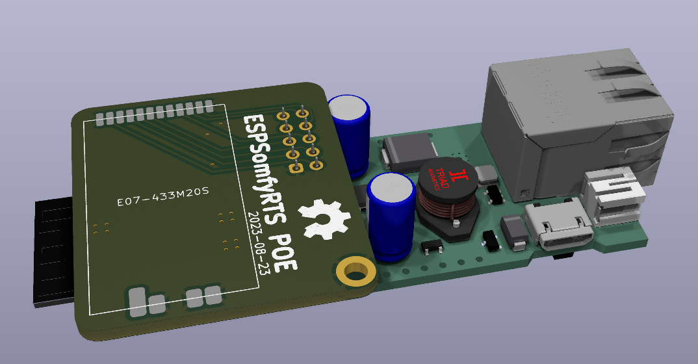
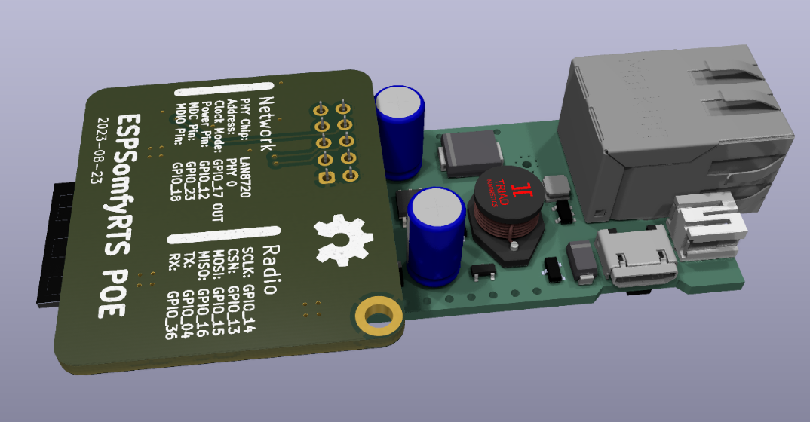
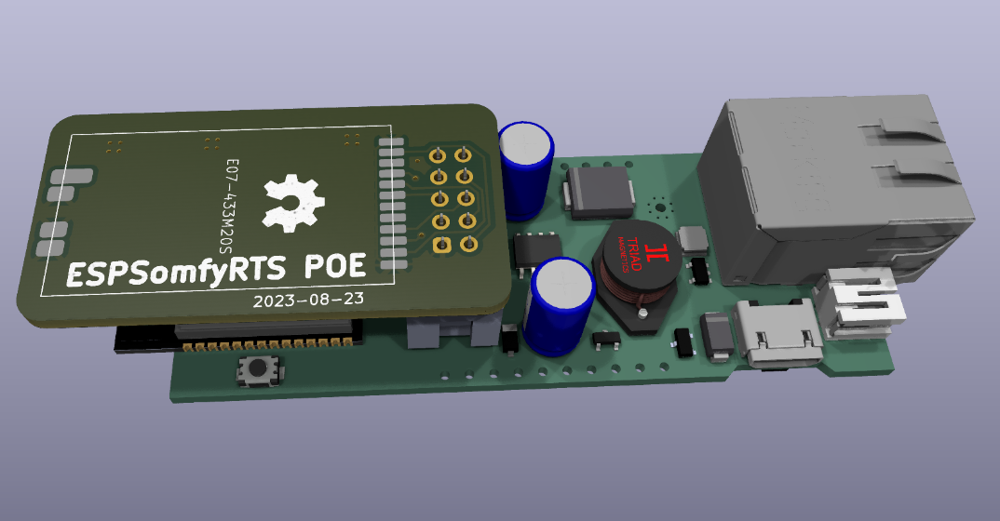

# ESP32 PoE Somfy RTS Bridge

## Partlist

- [ESP32 PoE](https://www.olimex.com/Products/IoT/ESP32/ESP32-POE/open-source-hardware)
- UEXT connector HIF3FB-10DA-2.54DSA(69)
- Ebyte [E07-433M20S](https://www.cdebyte.com/products/E07-433M20S)
- 433MHz Antenna

## Shield variants

### ESP32SomfyPOE

- C1101 radio module is mounted on the top side of the board
- One mounting hole for the header
- Length smaller than the ESP32 PoE board,
  fits in a [Raspberry Pi case](https://www.amazon.de/dp/B07CN5XYBN) or a junction box

### ESP32SomfyPOE_bottom

- C1101 radio module is mounted on the bottom side of the board
- Smaller height than the ESP32SomfyPOE variant
- One mounting hole for the header
- Length smaller than the ESP32 PoE board,
  fits in a [Raspberry Pi case](https://www.amazon.de/dp/B07CN5XYBN) or a junction box

### ESP32SomfyPOE_rotated

- Smallest variant, but no mounting hole for the header
- Ideal for a 3D printed case

## Software

https://github.com/rstrouse/ESPSomfy-RTS

## Configuration

### Radio

| Parameter | Value   |
| --------- | ------- |
| SCLK      | GPIO_14 |
| CSN       | GPIO_13 |
| MOSI      | GPIO_15 |
| MISO      | GPIO_16 |
| TX        | GPIO_04 |
| RX        | GPIO_36 |

### Network

| Parameter  | Value       |
| ---------- | ----------- |
| PHY Chip   | LAN8720     |
| Address    | PHY 0       |
| Clock Mode | GPIO_17 OUT |
| Power Pin  | GPIO_12     |
| MDC Pin    | GPIO_23     |
| MDIO Pin   | GPIO_18     |
